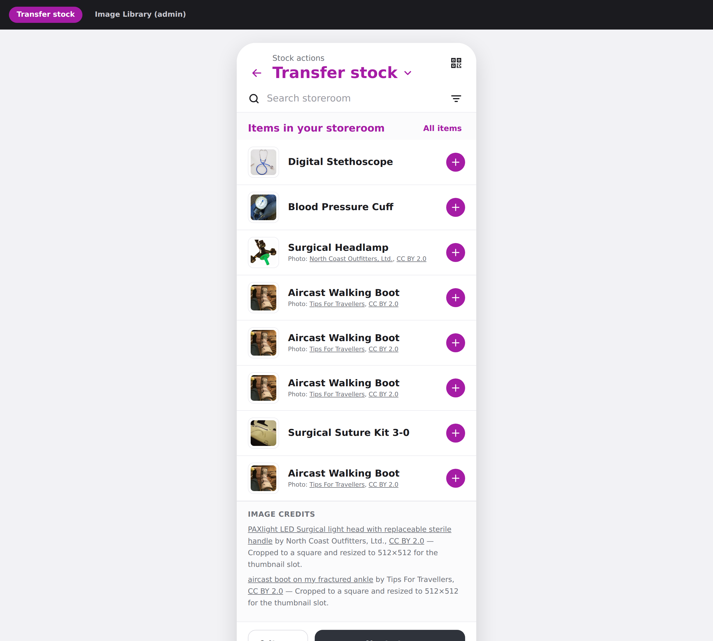
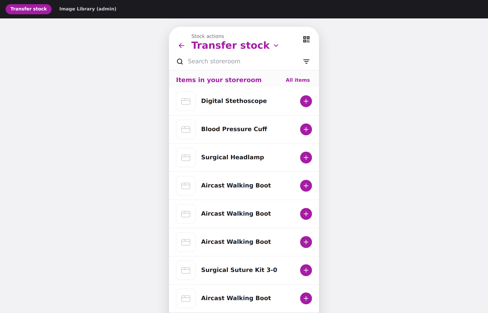
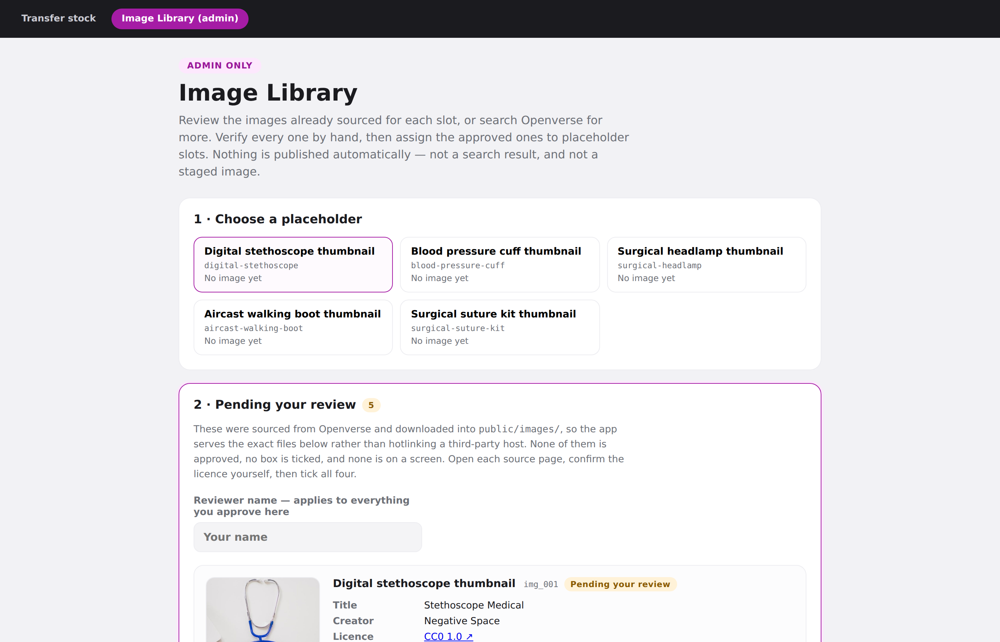

# Pulse — Transfer stock prototype + Image Library

A prototype of the **Transfer stock** storeroom screen, plus an admin-only **Image Library**
for sourcing openly licensed medical-equipment photographs from Openverse.

```bash
npm install
npm run dev        # http://localhost:5173
npm run check      # typecheck + tests
```

- `#/` — the Transfer stock screen
- `#/admin/image-library` — the Image Library (admin only)

## What it looks like

**Transfer stock, after approval** — what the screen is actually for. Each row carries its
own photograph, and the two CC BY images show a visible credit under the item name, with
the full entry in *Image credits* at the foot. CC0 images carry no inline credit, because
none is legally required.



**Transfer stock, on a fresh clone** — the same screen before anyone approves anything.
Every row shows a neutral placeholder. This is the correct first-run state, not a broken
build.



**Image Library (admin)** — where a named human reviews each sourced image and approves it.
The five photos exist in `public/images/` and are visible here while still being invisible
to the live screen above.



> **New here? Read [`docs/PHOTOS-GUIDE.md`](docs/PHOTOS-GUIDE.md) first.**
> A plain-English guide for designers and engineers: what the licence rules mean and why,
> how to add a photo click by click, how to use the Openverse API (including the gotchas
> that cost us time), how approvals work in code, and how to build this properly for
> production. This README is the reference; that guide is the explanation.

## What's in this repository

The whole repo is this one prototype — a Vite + React 18 + TypeScript app at the root.
There is no monorepo, no backend, and no build output checked in. 39 tracked files:
roughly 2,200 lines of TypeScript (580 of them tests), two prose documents, and five
photographs.

```
.
├── index.html                     Vite entry document
├── package.json                   Scripts and deps — React 18, Vite 5, Vitest 2
├── package-lock.json              Exact dependency tree; commit changes to it
├── tsconfig.json                  Strict TS config
├── vite.config.ts                 Vite + React plugin, and the Vitest config
├── .gitignore                     node_modules, dist, *.local, .DS_Store, tsbuildinfo
│
├── README.md                      This file — the reference
├── docs/
│   └── PHOTOS-GUIDE.md            The explanation: licences, sourcing, API gotchas (488 lines)
│
├── public/
│   └── images/                    The five served photographs, 180 KB total
│       ├── digital-stethoscope.jpg        (512×512, cropped from the upstream file)
│       ├── blood-pressure-cuff.jpg
│       ├── surgical-headlamp.jpg
│       ├── aircast-walking-boot.jpg
│       └── surgical-suture-kit.jpg
│
└── src/
    ├── main.tsx                   React root
    ├── App.tsx                    Hash routing; the admin route is off the main nav
    ├── styles.css                 All styling, hand-written (16 KB, no CSS framework)
    │
    ├── routes/
    │   ├── TransferStock.tsx      The storeroom screen — what a normal user sees
    │   └── AdminImageLibrary.tsx  The admin page: review, search, approve, assign
    │
    ├── components/
    │   ├── PlaceholderImage.tsx   Approved image, or a neutral fallback. No third path.
    │   ├── ImageCredit.tsx        Visible CC BY credit + the full credits block
    │   └── PendingReview.tsx      The four-checkbox approval panel
    │
    ├── image-library/             The domain logic — read this first
    │   ├── types.ts               The three data layers: Placeholder, LibraryImage, Assignment
    │   ├── placeholders.ts        The five slot ids. An id is a contract; never repurpose one.
    │   ├── resolve-image.ts       The app's ONLY route to an image. Assigned AND approved.
    │   ├── store.ts               Library + assignments; localStorage in the prototype
    │   ├── useImageLibrary.ts     React bindings over the store
    │   ├── license-policy.ts      Licence allowlist — CC0, PDM, CC BY. Nothing else.
    │   ├── ai-heuristic.ts        The "likely non-AI" metadata filter
    │   ├── openverse.ts           Search only. Never writes to the store.
    │   ├── search-source.ts       Live API, or offline fixtures
    │   ├── asset-url.ts           Resolves /images/… against Vite's BASE_URL
    │   ├── library.seed.json      The 5 checked-in images — all pending, none approved
    │   ├── assignments.seed.json  Empty: []. Nothing is bound to a slot yet.
    │   └── fixtures/
    │       └── openverse-sample.json   11 recorded search results for offline work
    │
    └── __tests__/                 86 tests, 5 suites, all passing
        ├── license-policy.test.ts    16 — the allowlist
        ├── ai-heuristic.test.ts      21 — word-boundary matching, the airway/repair cases
        ├── approval.test.ts          28 — the four-box gate and what gets stored
        ├── library-seed.test.ts      12 — fails the build if anything ships pre-approved
        └── pipeline.test.ts           9 — search → candidate → pending → approved
```

### What is *not* in git

`node_modules/` and `dist/` are ignored — run `npm install` after cloning. Nothing else is
generated; every file above is source you can read.

### The seed state, exactly

This matters more than it looks, because it is what you see on first run:

| | |
|---|---|
| Images in `library.seed.json` | **5** |
| Of those, `approved` | **0** — all five are `pending` |
| Entries in `assignments.seed.json` | **0** — the file is `[]` |
| Photos visible on the Transfer stock screen | **none**, by design |

So a fresh clone shows neutral grey placeholders on every storeroom row. That is not a
broken build. `resolveImage()` returns an image only when a slot has an assignment *and*
the record is `approved`, and nothing in the repo satisfies both. To see a photograph on
a screen you have to go to `#/admin/image-library` and approve one yourself — which is the
behaviour the prototype exists to demonstrate.

Two of the five carry a `sourcingNote` warning that the match is imperfect (the surgical
headlamp is a theatre lamp, not head-worn; the aircast boot has a brand name across the
strap). Read those notes before ticking the boxes — noticing them is the exercise.

### Commit history

| Commit | What |
|---|---|
| `9ab8a50` | `Add files via upload` — the original `.zip`, committed as a single binary |
| `80971ae` | The archive unpacked into the repo root, and the `.zip` removed |

The `.zip` is no longer in the working tree because its contents are now tracked
individually. It remains retrievable from `9ab8a50` if you ever want the original bundle.

## How images reach the app

One library, two statuses, and a search result must cross every boundary to go live:

```
Openverse search ─filter─▶ Candidate ─stage─▶ pending ─human approval─▶ approved ─assign─▶ Placeholder
   (ephemeral)            (ephemeral)        (stored, inert)            (stored)          (on screen)
```

Search results are never written to disk. A **pending** record is stored with full
provenance but is inert: `resolveImage()` returns an image only when a slot has an
assignment **and** the target record's status is `approved`, so neither a search result
nor a staged image has a path to a screen. `getApproved()` filters by status as well, so
the live app never even sees a pending record.

## The five checked-in images

`src/image-library/library.seed.json` ships one sourced image per placeholder slot, all
**pending**, none assigned, every verification box unticked. They are waiting for a
reviewer in `#/admin/image-library` — step 2, *Pending your review*.

| Slot | Image | Licence |
|---|---|---|
| `digital-stethoscope` | *Stethoscope Medical* by Negative Space | CC0 1.0 |
| `blood-pressure-cuff` | *Blood Pressure Cuff (Sphygmomanometer)* by Alabama Extension | CC0 1.0 |
| `surgical-headlamp` | *PAXlight LED Surgical light head…* by North Coast Outfitters, Ltd. | CC BY 2.0 |
| `aircast-walking-boot` | *aircast boot on my fractured ankle* by Tips For Travellers | CC BY 2.0 |
| `surgical-suture-kit` | *Vicryl surgical suture 3-0.31mm.70cm 01* by آرمین | CC0 1.0 |

Each record carries a `sourcingNote` — why the candidate was picked and what the reviewer
should weigh before ticking. The admin page shows it beside the checklist. Two of them say
the match is imperfect; read those before approving.

### Local files, not hotlinks

The app serves `public/images/<placeholder-id>.jpg`, downloaded from the upstream file at
sourcing time. The bytes we vetted are the bytes we ship: an upstream host cannot swap the
picture under an already-approved record, and no live screen makes a request to a
third-party host. Each record keeps `originalFileUrl` so the copy's provenance survives,
and `modifications` states what was changed — each file was cropped to a square and
resized to 512×512, which CC BY requires us to indicate.

## Adding a new placeholder

1. Add an entry to `PLACEHOLDERS` in `src/image-library/placeholders.ts`:

   ```ts
   {
     id: 'infusion-pump-card',            // stable, slug-shaped, never reused
     label: 'Infusion pump card image',
     searchWords: 'infusion pump medical equipment',
     shape: 'tall',
     needsPeople: false,
     allowsBrandLogos: false,
   }
   ```

2. Render it where the image belongs:

   ```tsx
   <PlaceholderImage placeholderId="infusion-pump-card" alt="Infusion pump" />
   ```

Until an image is assigned, the slot renders a neutral fallback — never a broken image.

**`id` is a contract.** It is referenced by assignments and approved records. Renaming one
orphans its assignment. Add new ids; never repurpose an existing one.

## Approving an image

Open `#/admin/image-library`. Step 2 lists everything already sourced; step 3 searches for
more. Either way the gate is the same.

1. **Review a pending image** (step 2), or **search** for a candidate (step 3). Search shows
   only CC0, Public Domain Mark and CC BY results; everything withheld is listed under
   *"results withheld by the filters"* with the reason, so you can see the filter working.
2. **Open the original source page and confirm the licence yourself.** The panel links to
   the source page, the licence, and the upstream file.
3. **Tick all four boxes** and enter your name. Approval stays disabled until every box is
   ticked and a reviewer is named — for a staged image and a fresh search result alike.
4. **Assign it.** Approval alone does not publish. A separate *"Assign to …"* / *"Use for …"*
   action binds the approved image to the slot. This two-step split is deliberate: nothing
   goes live by accident.

Nothing in the repo is pre-approved, and `library-seed.test.ts` fails the build if anything
ever is — a seeded `status: 'approved'` would put an unvetted photo on a screen.

### What gets saved

Every approved record stores title, creator, source page URL, exact licence, licence link,
attribution text, all four attestations, reviewer, and approval date.

### Attribution

CC BY images render a visible credit beneath the item name — creator and licence, linked to
the source page — and a fuller entry in the *Image credits* section at the foot of the
screen, which adds the title and the statement of changes. The inline credit is short
because a storeroom row is one line tall; it is never clipped, because a truncated credit
is not a credit. CC0 and Public Domain Mark carry no legal attribution
requirement, so their provenance goes to the accessible credit area without adding visual
noise to a dense list. Credits are never `title` tooltips — screen readers and touch users
cannot reach those.

## The "likely non-AI" filter

The filter excludes results whose title, tags, description or creator mention **AI,
generative, Midjourney, Stable Diffusion, DALL-E, synthetic** or **render**.

**It is "likely non-AI", not "guaranteed non-AI".** It reads metadata only. It cannot look
at the picture, and an AI image whose uploader did not label it will pass straight through.
That is why approval requires a human to confirm by eye.

Matching is word-boundaried, not substring. A naive `includes('ai')` would discard
*airway*, *repair*, *training* and *captain* — all plausible here. Text is also normalised
so underscored handles like `midjourney_bot` cannot hide behind `_`.

Two known trade-offs:

- **`synthetic` is matched as specified**, so a legitimate photo of a *synthetic graft* or
  *synthetic suture* would be withheld. Rejections are visible and reviewable, so this fails
  safe rather than silently.
- **`generator` is deliberately not matched** by the `generative` rule — an *oxygen
  generator* is real equipment.

## Configuration

| Where | What |
|---|---|
| `src/image-library/license-policy.ts` | The licence allowlist. It is an allowlist, so any new licence code Openverse adds is rejected until explicitly permitted. |
| `src/image-library/ai-heuristic.ts` | The AI term list and matching rules. |
| `src/image-library/placeholders.ts` | The placeholder registry. |
| `src/image-library/store.ts` | The library (pending + approved) and assignments. localStorage in the prototype; move behind the admin API for production. |
| `src/image-library/library.seed.json` | The checked-in images. Pending only. |
| `public/images/` | The downloaded files the app serves. |

### Offline fixtures

The admin page defaults to **Use offline fixtures**, which runs the identical filter
pipeline over `src/image-library/fixtures/openverse-sample.json`. Untick it to query
`api.openverse.org` live.
